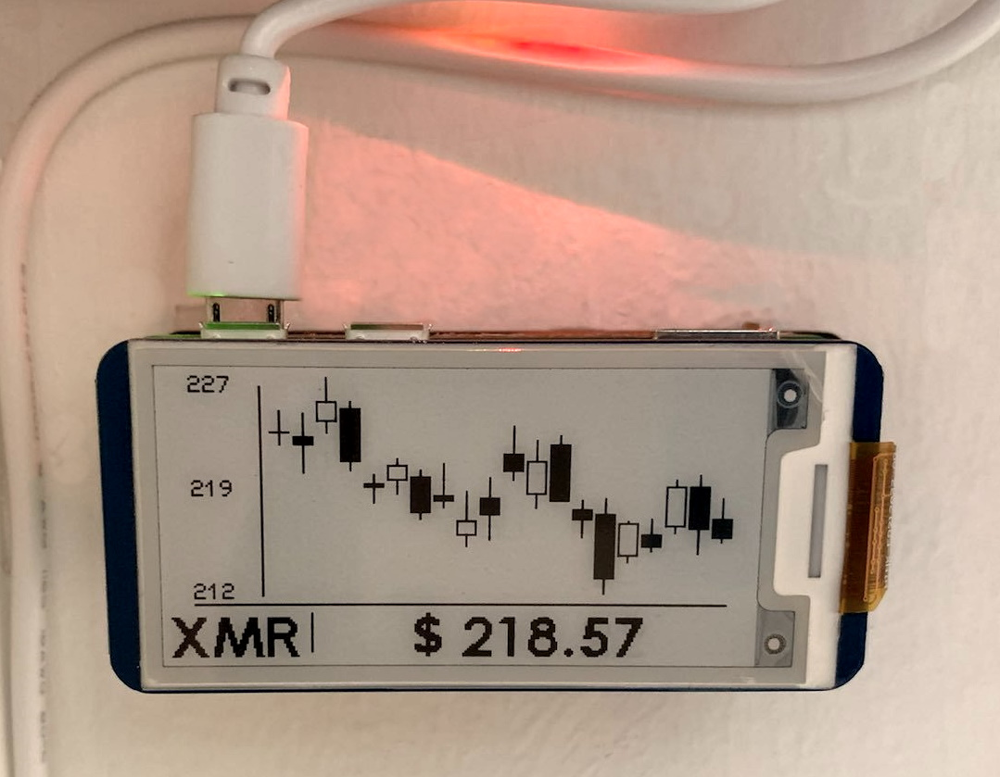

# Zero XMR Ticker - Monero (& other) price ticker for your RPi
## An easy XMR adaptation based on Dr Mods amazing zero-btc-screen



## Hardware

### Platform

* Raspberry Pi Zero W (or any other RPi)

### Screens

* Waveshare eInk displays: epd2in13v2, epd2in13bv3 (see https://www.waveshare.com/wiki/2.13inch_e-Paper_HAT)
* inkyWhat (Red, Black, White - see https://www.adafruit.com/product/4143) 
* Virtual (picture file output)

## Preparation

1. Download and Flash Raspbian Lite onto SD card (download from https://www.raspberrypi.org/software/operating-systems/)

2. Boot RPi and connect RPi via LAN connection (RPi 3-4) or configure WIFI (Any RPi) by either:
   1. With LAN+SSH (or Screen): Configuring Wifi via `sudo raspi-config`
   2. Without LAN (or Screen): Reinsert the flashed SD card into your computer (not RPi) and create a new file called wpa_supplicant.conf with the following text, replacing “YOUR_NETWORK_NAME” and “YOUR_NETWORK_PASSWORD” with your information. A source code editor such as Atom works great for this purpose. WordPad and Notepad are not recommended to create this file as extra characters are added in the formatting process. 
  
  ```
    country=us
    update_config=1
    ctrl_interface=/var/run/wpa_supplicant

    network={
     scan_ssid=1
     ssid="YOUR_NETWORK_NAME"
     psk="YOUR_NETWORK_PASSWORD"
}
 ```

3. Eject SD, insert into RPi Zero W and boot
4. SSH into RPi


## Installation 

1. Turn on SPI via `sudo raspi-config`
    ```
    Interfacing Options -> SPI
   ```
2. Install dependencies
    ```
    sudo apt update
    sudo apt-get install python3-pip python3-pil python3-numpy
    pip3 install RPi.GPIO spidev
    ```

3. Install drivers for your display
    1. Waveshare display
    ```
    git clone https://github.com/waveshare/e-Paper.git ~/e-Paper
    pip3 install ~/e-Paper/RaspberryPi_JetsonNano/python/
    ```
   for more information refer to: https://www.waveshare.com/wiki/2.13inch_e-Paper_HAT
    2. Inky wHAT display
    ```
    pip3 install inky[rpi]
    ```
4. Download Zero XMR Ticker
    ```
    git clone https://github.com/Experts-say/zero-xmr-ticker.git ~/zero-xmr-ticker
    ```
5. Run it
    ```
    python3 ~/zero-xmr-ticker/main.py
    ```


## Screen configuration

The application supports multiple types of e-ink screens, and an additional "picture" screen.

To configure which display(s) to use, configuration.cfg should be modified. In the following example an e-ink epd2in13v2
AND "picture" screens are select by un-# their lines below :

```cfg
[base]
console_logs             : false
#logs_file               : /tmp/zero-xmr-ticker.log
dummy_data               : false
refresh_interval_minutes : 10
currency                 : XMR

# Enabled screens or devices
screens : [
    epd2in13v2
#    epd2in13bv3
    picture
#    inkyWhatRBW
  ]

# Configuration per screen
# This doesn't make any effect if screens are not enabled above
[epd2in13v2]
mode : candle

[epd2in13bv3]
mode  : line

[picture]
filename : /home/pi/output.png

[inkyWhatRBW]
mode : candle
```

### Autostart

To make it run on startup edit the system's services daemon
    1. Create a new service configuration file
       ```
        sudo nano /etc/systemd/system/xmr-ticker.service
        ```
    2. Copy and paste the following into the service configuration file and change any settings to match your
       environment
       ```
        [Unit]
        Description=zero-xmr-ticker
        After=network.target
 
        [Service]
        ExecStart=/usr/bin/python3 -u main.py
        WorkingDirectory=/home/pi/zero-xmr-ticker
        StandardOutput=inherit
        StandardError=inherit
        Restart=always
        User=pi
 
        [Install]
        WantedBy=multi-user.target
        ```
    3. Enable the service so that it starts whenever the RPi is rebooted
       ```
        sudo systemctl enable xmr-ticker.service
       ```
    4. Start the service and enjoy!
       ```
        sudo systemctl start xmr-ticker.service
       ```

       If you need to troubleshoot you can use the logging configurations of this program (mentioned below).
       Alternatively, you can check to see if there is any output in the system service logging.
       ```
        sudo journalctl -f -u xmr-ticker.service
       ```

Full credit to dr-mod and team. 
Descriptions and 1% of code adjusted to XMR by Motherland Engineering
